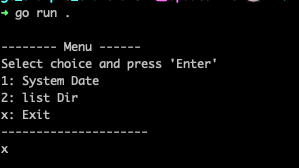

# go_example_cmdMenu
This is a simple go command line program that displays a menu and take cmd line input.

## run cmd
go run .

## build
build for linux on docker
> build.sh

## docker
### docker build
> dockerBuild.sh

### docker run
> dockerRun.sh

